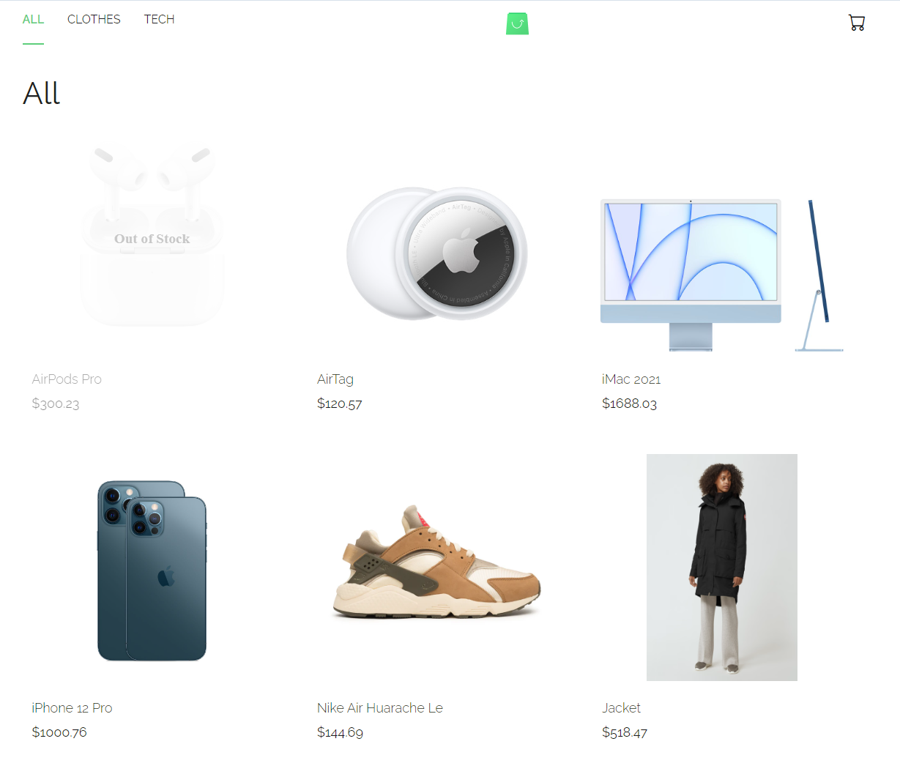
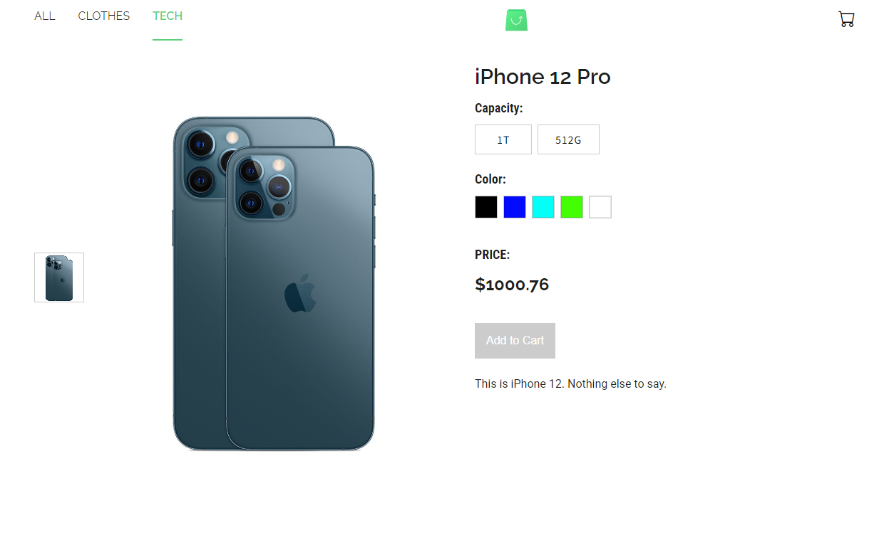
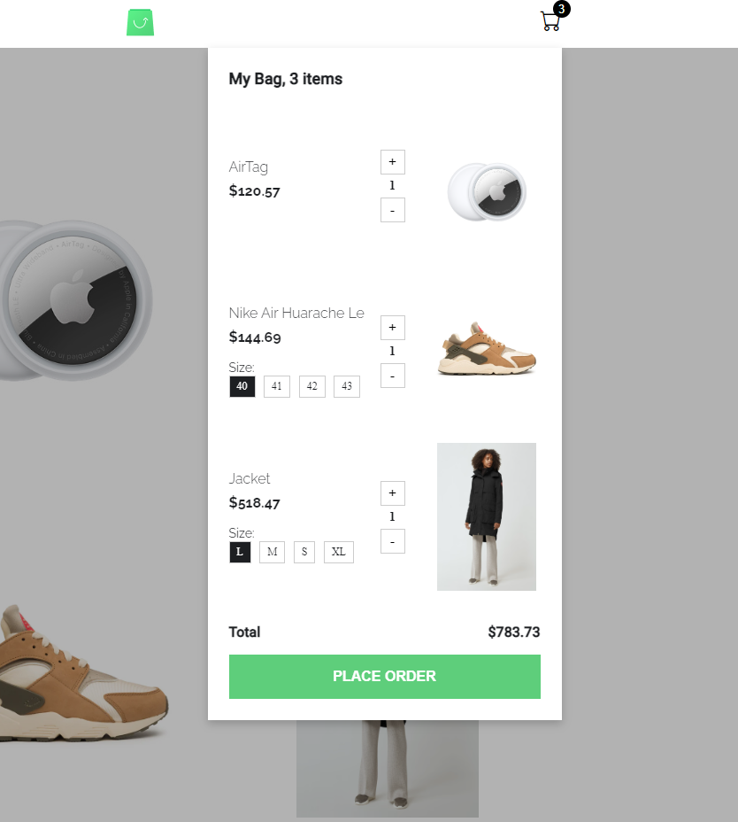

# E-Commerce Project

A **full-stack** eCommerce website with product listings, cart functionality, and a GraphQL-based backend.

**E-Commerce App Preview**


## Live Demo

This project is published and can be viewed here:

[**Deployed Frontend**](https://67aa6b37ace7c600086b772a--yy-ecommerce.netlify.app/all)

## Table of Contents

1. [Overview](#overview)
2. [Features](#features)
3. [Screenshots](#screenshots)
4. [Tech Stack](#tech-stack)
5. [Installation & Setup](#installation--setup)
6. [Usage](#usage)
7. [Project Structure](#project-structure)
8. [Additional Notes](#additional-notes)
9. [License](#license)

---

## Overview

This project implements a **simple eCommerce website** with the following core functionalities:

- **Product Listing Pages (Categories):** Browse products by category.
- **Product Details Page (PDP):** View product images, details, and attributes; add to cart.
- **Cart Overlay:** A cart accessible on any page, showing selected products and their total.
- **GraphQL Backend:** Exposes queries and mutations for categories, products, and order creation.

It uses **PHP** (no frameworks) for the backend (with GraphQL), **MySQL** for the database, and **React** for the frontend (built with Vite). The data is provided by a `data.json` file loaded into the MySQL database.

---

## Features

1. **Responsive SPA**
   - Frontend built in React (Vite) with routing.
2. **GraphQL Server**
   - Retrieve products, categories, and create orders via GraphQL.
3. **Cart Functionality**
   - Add products, manage quantities, see a total, place an order.
4. **Attribute Selection**
   - Choose color/sizes for each product.
5. **Dockerized Environment**
   - Uses Docker Compose for local development.

---

## Screenshots

**Product Listing Page**  


**Product Details Page**  


**Cart Overlay**  


---

## Tech Stack

- **Backend:** PHP 8.1+
  - Plain PHP (no frameworks), GraphQL schema & resolvers
  - MySQL 5.7 for data storage
- **Frontend:** React (Vite)
  - SCSS for styling
  - Minimal libraries (no major UI frameworks)
- **Docker:** Docker Compose for local setup

---

## Installation & Setup

1. **Clone this Repository**
   ```bash
   git clone https://github.com/username/Ecommerce_Project.git
   cd Ecommerce_Project
   ```
2. **Configure Environment**
   - Check `docker-compose.yml` if you need to adjust any ports or environment variables.
   - By default, MySQL runs on port `3307`, the PHP container on `8000`, and the React dev server on `5173`.
3. **Run with Docker**
   ```bash
   docker-compose up -d --build
   ```
   - **php-container:** Runs Apache + PHP + GraphQL server
   - **mysql-container:** MySQL 5.7
   - **frontend:** React app (Vite dev server on `http://localhost:5173`)
4. **Database & Seeding**
   - On first run, the project automatically runs `migrate.php` and `populate.php` to create tables and insert data from `data.json`.
   - If needed, check container logs or manually re-run `docker-compose down && docker-compose up -d --build` if you want a fresh start.

---

## Usage

- **Open the Frontend** in your browser:
  ```
  http://localhost:5173
  ```
- **Browse Categories**:
  - Try routes like `/all`, `/tech`, `/clothes` (depending on how you configured categories).
- **View a Product**:
  - Click on any product card to see its details (gallery, attributes).
- **Add to Cart**:
  - On PDP: Select the required attributes, then click “Add to Cart.”
  - On PLP (product listing page): Some in-stock products may have a “Quick Shop” button.
- **Cart Overlay**:
  - The cart icon in the header (`data-testid='cart-btn'`) toggles the cart overlay.
  - Increase/decrease quantities or remove items.
- **Place Order**:
  - The “Place Order” button calls a GraphQL mutation to create a new order in the DB.
  - The cart is then cleared.

---

## Project Structure

```
Ecommerce_Project/
├─ backend/
│  ├─ docker/
│  ├─ src/
│  └─ data/
├─ frontend/
│  ├─ docker/
│  ├─ src/
│  └─ public/
├─ db/
├─ docker-compose.yml
└─ README.md
```

**Key Directories**:

- **`backend/src`**: Contains PHP classes for GraphQL schema, resolvers, and DB seeding.
- **`frontend/src`**: React application, with pages for Product Listing, Product Detail, Cart Overlay, etc.
- **`db`**: SQL migrations or additional scripts.
- **`docker-compose.yml`**: Orchestrates containers: MySQL, PHP (Apache), and React dev server.

---

## License

This project is open-sourced for demonstration purposes and is free to use, modify, and distribute.
Feel free to adapt or extend it for your own learning and development needs.
